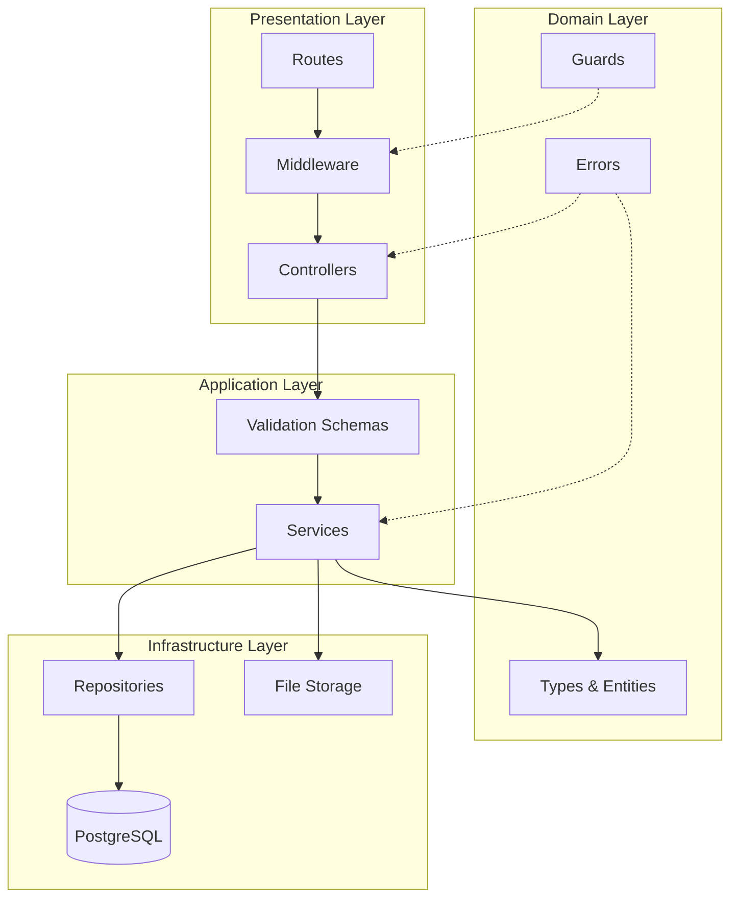
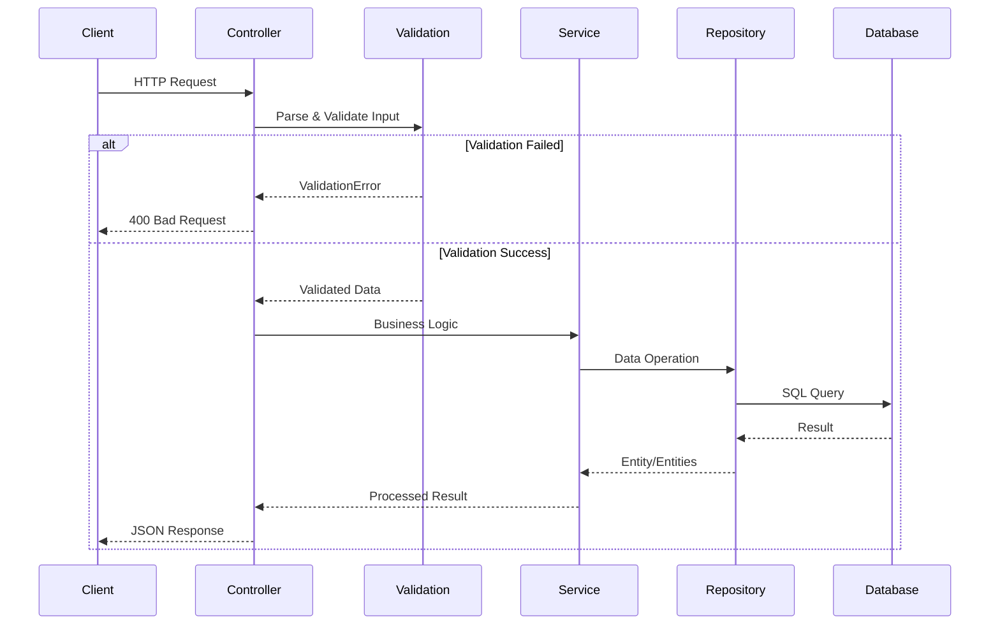
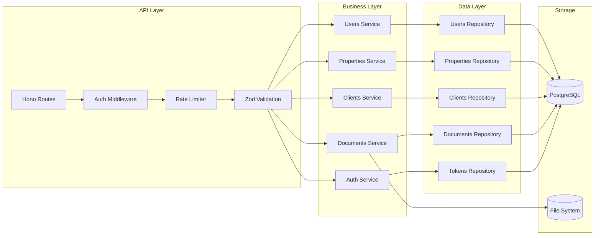
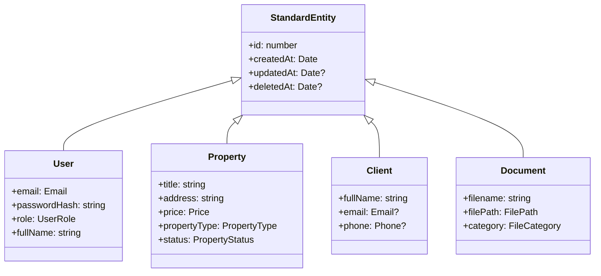
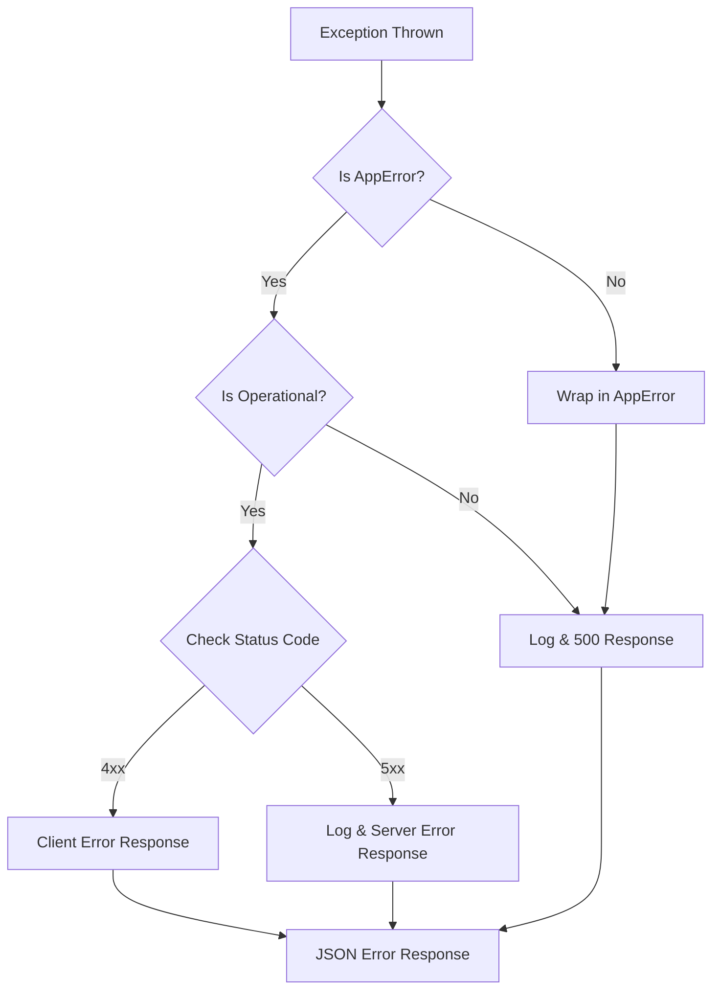
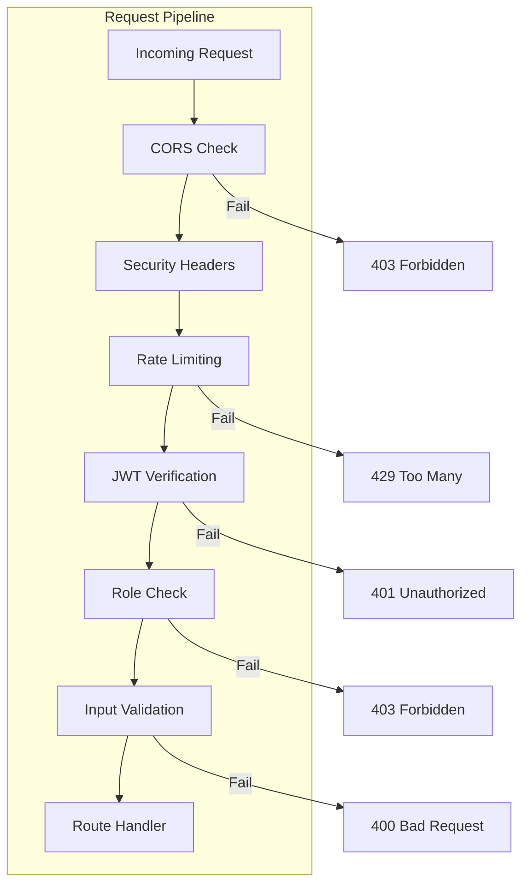
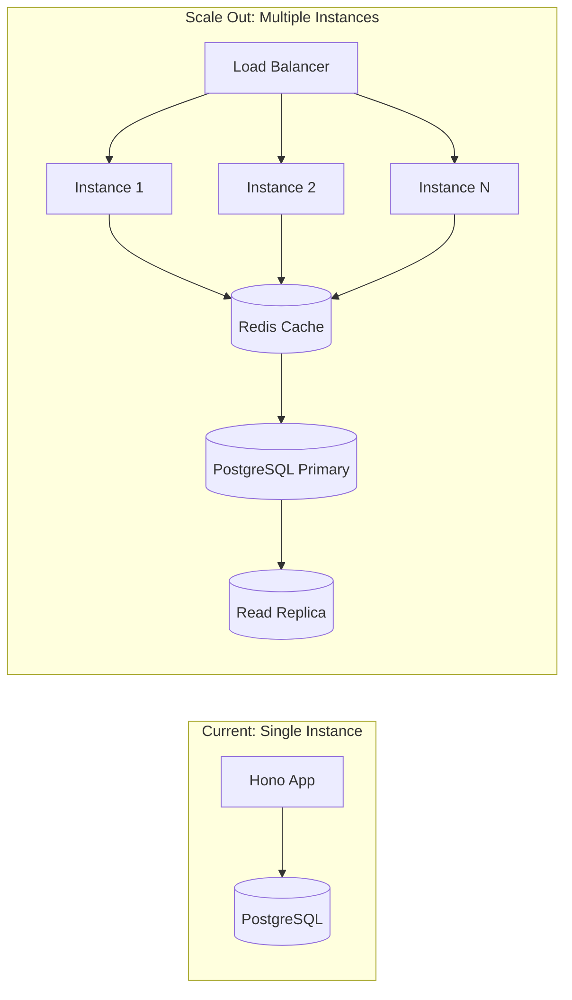

# Architecture Documentation

## System Overview

The Inmobiliaria System follows a **Clean Architecture** / **Hexagonal Architecture** pattern with clear separation of concerns.

## Layer Diagram



## CRUD Flow Diagram



## Component Architecture



## Type System Hierarchy



## Error Handling Flow



## Design Patterns Used

### 1. Repository Pattern
- Abstracts data access layer
- Enables swapping data sources
- Provides type-safe queries

### 2. Service Pattern
- Contains business logic
- Orchestrates repositories
- Validates business rules

### 3. Controller Pattern
- Handles HTTP concerns
- Delegates to services
- Formats responses

### 4. Factory Pattern (Implicit)
- Schema validation creates validated objects
- Type-safe object construction

### 5. Strategy Pattern
- Filter builders in repositories
- Different validation strategies per route

### 6. Observer Pattern (Logging)
- Centralized logging
- Decoupled from business logic

## SOLID Principles Enforcement

### Single Responsibility (S)
- Each class has one reason to change
- Controllers handle HTTP only
- Services handle business logic only
- Repositories handle data only

### Open/Closed (O)
- Base classes extendable without modification
- New entities via extension, not modification

### Liskov Substitution (L)
- Subclasses work wherever base class expected
- CRUDService subclasses maintain contract

### Interface Segregation (I)
- Small, focused interfaces
- Type-specific filters per entity

### Dependency Inversion (D)
- High-level modules independent of low-level
- Dependencies flow inward to domain

## Security Layers



## File Structure

```
backend/
├── src/
│   ├── controllers/     # HTTP handlers
│   │   ├── base/        # Abstract base controller
│   │   └── *.controller.ts
│   ├── services/        # Business logic
│   │   ├── base/        # Abstract base service
│   │   └── *.service.ts
│   ├── repositories/    # Data access
│   │   ├── base/        # Abstract base repository
│   │   └── *.repository.ts
│   ├── middleware/      # Request pipeline
│   ├── routes/          # Route definitions
│   ├── validation/      # Zod schemas
│   ├── types/           # TypeScript types
│   │   ├── branded.ts   # Branded types
│   │   ├── result.ts    # Result pattern
│   │   ├── utility.ts   # Utility types
│   │   ├── guards.ts    # Type guards
│   │   └── errors.ts    # Error classes
│   ├── utils/           # Helpers
│   ├── lib/             # Core utilities
│   │   ├── constants.ts # Magic numbers eliminated
│   │   └── logger.ts    # Structured logging
│   └── database/        # DB connection & schema
├── tests/               # Test suites
│   ├── unit/
│   ├── integration/
│   ├── e2e/
│   ├── security/
│   └── performance/
└── drizzle.config.ts
```

## Performance Considerations

1. **Database**
   - Connection pooling (2-10 connections)
   - Indexed queries on common filters
   - Soft deletes for audit trail

2. **API**
   - Pagination on all list endpoints
   - Rate limiting per endpoint type
   - Gzip compression

3. **Memory**
   - Streaming for file uploads
   - Lazy loading where applicable
   - No memory caching (stateless)

## Scalability Path


